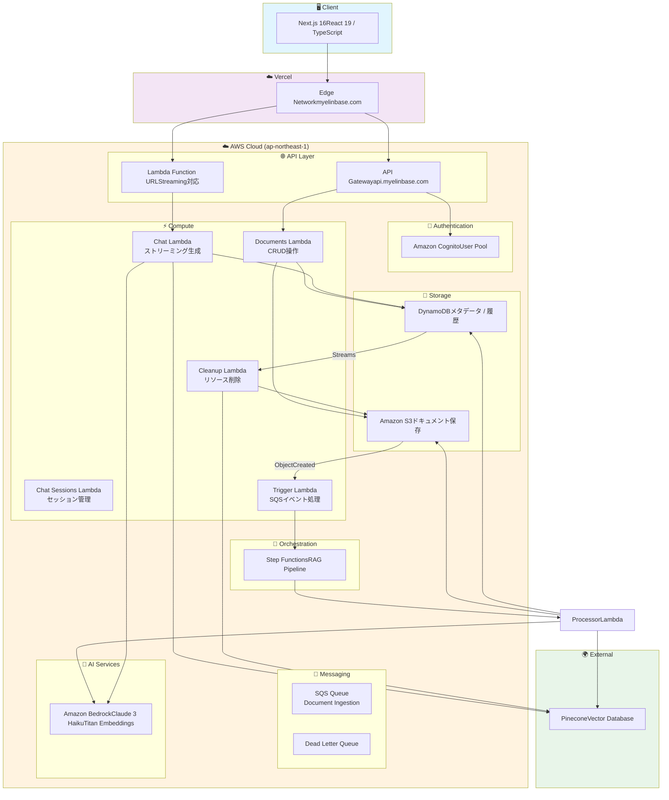
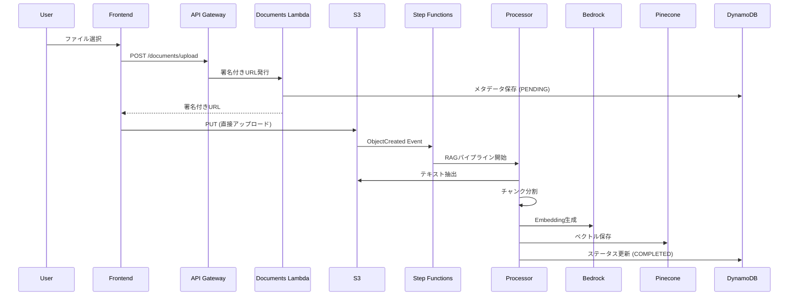

# Myelin Base - RAG Application Backend

<p align="center">
  
  
  
  
</p>

## 🌐 Live Demo

| 環境                   | URL                                              |
| ---------------------- | ------------------------------------------------ |
| **アプリケーション**   | [https://myelinbase.com](https://myelinbase.com) |
| **API エンドポイント** | `https://api.myelinbase.com`                     |

> 📦 **関連リポジトリ**: [frontend](https://github.com/r-serori/myelinbase-frontend) - Next.js フロントエンド

---

AWS Serverless RAG（Retrieval-Augmented Generation）アプリケーションのバックエンドシステムです。ドキュメントのアップロード、非同期処理パイプライン、AI によるストリーミングチャット機能を提供します。

## 🏗️ システムアーキテクチャ



### 📊 データフロー

#### ドキュメントアップロード → RAG処理



#### AIチャット（ストリーミング）


---

## 📋 目次

- [概要](#概要)
- [主な機能](#主な機能)
- [アーキテクチャ](#アーキテクチャ)
- [技術スタック](#技術スタック)
- [クイックスタート](#クイックスタート)
- [セットアップ](#セットアップ)
- [開発ガイドライン](#開発ガイドライン)
- [セキュリティ](#セキュリティ)
- [モニタリング](#モニタリング)
- [コスト最適化](#コスト最適化)
- [トラブルシューティング](#トラブルシューティング)
- [コントリビューション](#コントリビューション)

## 概要

Myelin Base は、ドキュメントをアップロードすると自動的にテキスト抽出・チャンク分割・ベクトル化が行われ、アップロードしたドキュメントをコンテキストとして AI とチャットができる RAG アプリケーションです。

### 主な機能

- 📄 **ドキュメント管理** - PDF/テキストファイルのアップロード、タグ管理、署名付きURLによるセキュアなダウンロード、重複検知
- 🤖 **RAG チャット** - アップロードしたドキュメントを参照しながら AI とリアルタイムストリーミングチャット（Vercel AI SDK 互換）
- ⚙️ **非同期処理パイプライン** - AWS Step Functions による堅牢な ETL パイプライン（テキスト抽出 → チャンク分割 → ベクトル化 → インデックス化）
- 🔐 **認証・認可** - Amazon Cognito による安全なユーザー認証とユーザーごとのデータ分離
- ⚡ **サーバーレス** - スケーラブルで従量課金のコスト効率の良いアーキテクチャ
- 🐳 **ローカル開発** - LocalStack と DynamoDB Local による完全なローカル開発環境

## アーキテクチャ

### システム全体像

```text
┌─────────────────────────────────────────────────────────────────────────┐
│                              Frontend (Next.js)                          │
│                         https://app.myelinbase.com                       │
└──────────────────────────────┬──────────────────────────────────────────┘
                                │ HTTPS
                                ▼
┌─────────────────────────────────────────────────────────────────────────┐
│                              AWS Cloud                                   │
│                                                                           │
│  ┌──────────────────┐                                                    │
│  │  Cognito         │  User Authentication & Authorization              │
│  │  User Pool       │                                                    │
│  └────────┬─────────┘                                                    │
│           │                                                               │
│           ▼                                                               │
│  ┌──────────────────┐     ┌──────────────────┐                          │
│  │  API Gateway      │────▶│  Lambda          │                          │
│  │  REST API         │     │  Functions       │                          │
│  │  (Cognito Auth)   │     │  - Documents     │                          │
│  └──────────────────┘     │  - Chat Sessions │                          │
│                           └──────────────────┘                          │
│                                                                           │
│  ┌──────────────────┐     ┌──────────────────┐                          │
│  │  Lambda          │     │  Lambda          │                          │
│  │  Function URL    │     │  Function URL    │                          │
│  │  (Chat Streaming)│     │  (Chat Streaming)│                          │
│  └──────────────────┘     └──────────────────┘                          │
│                                                                           │
│  ┌──────────────────┐     ┌──────────────────┐                          │
│  │  DynamoDB        │     │  S3 Bucket        │                          │
│  │  - Documents     │◀───▶│  - File Storage  │                          │
│  │  - Chat History  │     │                  │                          │
│  └────────┬─────────┘     └────────┬─────────┘                          │
│           │                         │                                    │
│           │ DynamoDB Streams        │ S3 Events                         │
│           │                         │                                    │
│           ▼                         ▼                                    │
│  ┌──────────────────┐     ┌──────────────────┐                          │
│  │  Lambda          │     │  Lambda          │                          │
│  │  - Processor     │     │  - Trigger       │                          │
│  │  - Cleanup       │     │                  │                          │
│  └────────┬─────────┘     └────────┬─────────┘                          │
│           │                         │                                    │
│           └──────────┬──────────────┘                                    │
│                      ▼                                                    │
│           ┌──────────────────┐                                           │
│           │  Step Functions   │                                           │
│           │  RAG Pipeline    │                                           │
│           └────────┬─────────┘                                           │
│                    │                                                      │
│                    ▼                                                      │
│  ┌──────────────────┐     ┌──────────────────┐                          │
│  │  AWS Bedrock     │     │  Pinecone        │                          │
│  │  - Claude 3      │     │  Vector DB       │                          │
│  │  - Titan Embed   │     │                  │                          │
│  └──────────────────┘     └──────────────────┘                          │
└─────────────────────────────────────────────────────────────────────────┘
```

### データフロー

#### 1. ドキュメントアップロードフロー

```text
Client → API Gateway → Documents Lambda
  ↓
1. 署名付きURL発行
  ↓
Client → S3 (直接アップロード)
  ↓
S3 Event → Trigger Lambda
  ↓
Step Functions (RAG Pipeline)
  ├─ テキスト抽出 (PDF → Text)
  ├─ チャンク分割 (Overlapping Window)
  ├─ エンベディング生成 (Bedrock Titan)
  └─ ベクトル保存 (Pinecone)
  ↓
DynamoDB ステータス更新 (COMPLETED)
```

#### 2. チャットフロー

```text
Client → Chat Lambda (Function URL)
  ↓
1. クエリエンベディング生成 (Bedrock Titan)
  ↓
2. Pinecone で類似ベクトル検索
  ↓
3. コンテキスト構築
  ↓
4. Bedrock Claude でストリーミング生成
  ↓
5. メッセージ履歴を DynamoDB に保存
```

#### 3. 削除フロー

```text
Client → API Gateway → Documents Lambda
  ↓
DynamoDB ステータス更新 (DELETING)
  ↓
DynamoDB Streams → Processor Lambda
  ├─ S3 ファイル削除
  ├─ Pinecone ベクトル削除
  └─ DynamoDB レコード物理削除
```

### 環境構成

| 環境            | ブランチ  | デプロイ先 | 認証                |
| --------------- | --------- | ---------- | ------------------- |
| **Local**       | -         | LocalStack | バイパス (user-001) |
| **Development** | `develop` | AWS (dev)  | Cognito             |
| **Production**  | `main`    | AWS (prod) | Cognito             |

## 技術スタック

| カテゴリ               | 技術                                              |
| ---------------------- | ------------------------------------------------- |
| **ランタイム**         | Node.js 20.x / TypeScript 5.9                     |
| **IaC**                | AWS SAM (Serverless Application Model)            |
| **コンピューティング** | AWS Lambda (arm64)                                |
| **API**                | API Gateway REST API                              |
| **認証**               | Amazon Cognito                                    |
| **データベース**       | DynamoDB                                          |
| **ストレージ**         | Amazon S3                                         |
| **AI/ML**              | Amazon Bedrock (Claude 3 Haiku, Titan Embeddings) |
| **ベクトルDB**         | Pinecone                                          |
| **ワークフロー**       | AWS Step Functions                                |
| **ローカル開発**       | LocalStack, Docker Compose                        |

## クイックスタート

### 5分で始めるローカル開発

```bash
# 1. リポジトリのクローン
git clone <repository-url>
cd myelinbase-backend

# 2. 依存関係のインストール
npm install

# 3. Docker コンテナの起動
npm run local:start

# 4. ローカル環境へのデプロイ
npm run deploy:local

# 5. SAM Local API の起動（別ターミナル）
npm run api:start
```

### 次のステップ

1. [セットアップ](#セットアップ) - 詳細なセットアップ手順
2. [API エンドポイント](#api-エンドポイント) - API の使用方法
3. [開発ガイドライン](#開発ガイドライン) - 開発のベストプラクティス

## プロジェクト構成

```
myelinbase-backend/
├── infrastructure/              # AWS SAM テンプレート & Lambda関数
│   ├── src/
│   │   ├── functions/          # Lambda関数群
│   │   │   ├── chat/           # チャットAPI (ストリーミング)
│   │   │   │   ├── index.ts    # メインハンドラー
│   │   │   │   ├── index.test.ts
│   │   │   │   └── README.md   # 関数ドキュメント
│   │   │   ├── chat-sessions/  # チャットセッション管理
│   │   │   ├── documents/      # ドキュメント管理API
│   │   │   ├── processor/      # DynamoDB Streamsプロセッサ
│   │   │   ├── cleanup/        # TTL削除クリーンアップ
│   │   │   └── trigger/        # S3イベントトリガー
│   │   └── shared/             # 共有ユーティリティ & クライアント
│   │       ├── clients/         # 外部サービスクライアント
│   │       │   ├── bedrock.ts   # AWS Bedrock
│   │       │   └── pinecone.ts # Pinecone
│   │       ├── schemas/        # Zod スキーマ
│   │       ├── types/           # TypeScript 型定義
│   │       └── utils/           # ユーティリティ関数
│   ├── template.yaml            # SAMテンプレート (AWS環境)
│   ├── template-local.yaml      # SAMテンプレート (ローカル環境)
│   ├── samconfig.toml           # SAMデプロイ設定
│   └── README.md                # インフラドキュメント
├── local-dev/                   # ローカル開発環境
│   ├── docker-compose.yml       # Docker Compose 設定
│   ├── scripts/                 # デプロイスクリプト
│   │   └── deploy-local.sh      # ローカルデプロイスクリプト
│   ├── env.local.json           # SAM Local 環境変数
│   └── LOCAL_DEVELOPMENT.md     # ローカル開発ガイド
├── doc/                         # API ドキュメント
│   ├── openapi.yaml             # OpenAPI仕様
│   └── API_RESPONSE_GUIDE.md    # API レスポンスガイド
└── package.json                 # npm workspaces設定
```

### 主要ディレクトリの説明

- **`infrastructure/src/functions/`**: 各 Lambda 関数の実装とテスト
- **`infrastructure/src/shared/`**: 全関数で共有されるコード（Lambda Layer）
- **`local-dev/`**: LocalStack と DynamoDB Local を使ったローカル開発環境
- **`doc/`**: API 仕様書とドキュメント

各関数の詳細は、各ディレクトリの `README.md` を参照してください。

## セットアップ

### 前提条件

#### 必須ツール

- **Node.js** 20.x 以上
- **Docker** & Docker Compose (ローカル開発用)
- **AWS CLI** v2 以上
- **AWS SAM CLI** 1.100.0 以上
- **Git**

#### オプションツール

- **LocalStack CLI** (awslocal コマンド用)
- **AWS Account** (AWS環境へのデプロイ時)

### 初期セットアップ

```bash
# 1. リポジトリのクローン
git clone <repository-url>
cd myelinbase-backend

# 2. 依存関係のインストール
npm install

# 3. 環境変数の設定（必要に応じて）
cp .env.example .env
```

### ローカル開発環境

#### 1. Docker コンテナの起動

```bash
# LocalStack と DynamoDB Local を起動
npm run local:start

# 起動確認
docker-compose ps
```

#### 2. ローカル環境へのデプロイ

```bash
# LocalStack にデプロイ
npm run deploy:local

# デプロイ後、API エンドポイントが表示されます
# 例: http://localhost:4566/restapis/<api-id>/local/_user_request_/
```

#### 3. SAM Local API の起動（別ターミナル）

```bash
# API Gateway をエミュレート
npm run api:start

# デフォルトで http://localhost:3000 で起動
```

#### 4. 動作確認

```bash
curl http://localhost:3000
```

### AWS 開発環境へのデプロイ

#### 事前準備

1. **AWS 認証情報の設定**

```bash
aws configure
# AWS Access Key ID
# AWS Secret Access Key
# Default region: ap-northeast-1
# Default output format: json
```

2. **SSM Parameter Store に Pinecone API キーを保存**

```bash
aws ssm put-parameter \
  --name /myelinbase/dev/pinecone-api-key \
  --value "your-pinecone-api-key" \
  --type SecureString \
  --region ap-northeast-1
```

3. **Pinecone インデックスの作成**

Pinecone コンソールでインデックスを作成し、`PINECONE_INDEX_NAME` 環境変数に設定します。

#### デプロイ

```bash
# develop ブランチに切り替え
git checkout develop

# ビルド & デプロイ
npm run deploy:dev

# デプロイ完了後、出力されるエンドポイントを確認
# - ApiEndpoint: API Gateway エンドポイント
# - ChatAgentEndpoint: Chat Function URL
```

### 本番環境へのデプロイ

#### 事前準備

1. **本番環境用パラメータの設定**

`infrastructure/samconfig.toml` の `[prod.deploy.parameters]` セクションを確認・更新します。

2. **SSM Parameter Store に本番用 Pinecone API キーを保存**

```bash
aws ssm put-parameter \
  --name /myelinbase/prod/pinecone-api-key \
  --value "your-production-pinecone-api-key" \
  --type SecureString \
  --region ap-northeast-1
```

#### デプロイ

```bash
# main ブランチに切り替え
git checkout main

# ビルド & デプロイ（確認プロンプトあり）
npm run deploy:prod
```

> **注意**: 本番環境へのデプロイは慎重に行ってください。`samconfig.toml` で `confirm_changeset = true` が設定されているため、変更内容の確認が求められます。

## npm スクリプト

| コマンド               | 説明                                            |
| ---------------------- | ----------------------------------------------- |
| `npm run local:start`  | ローカル環境を起動 (LocalStack, DynamoDB Local) |
| `npm run local:stop`   | ローカル環境を停止                              |
| `npm run local:reset`  | ローカル環境をリセット (データ削除)             |
| `npm run deploy:local` | LocalStackへデプロイ                            |
| `npm run deploy:dev`   | AWS開発環境へデプロイ                           |
| `npm run deploy:prod`  | AWS本番環境へデプロイ                           |
| `npm run build`        | SAMビルド                                       |
| `npm run validate`     | SAMテンプレート検証                             |
| `npm run lint`         | ESLint実行                                      |
| `npm run test`         | テスト実行                                      |
| `npm run doc:generate` | OpenAPIドキュメント生成                         |

## 環境変数

### 共通環境変数

すべての Lambda 関数で共通の環境変数です。`template.yaml` の `Globals.Function.Environment.Variables` で定義されています。

| 変数名                            | 必須 | デフォルト                               | 説明                             |
| --------------------------------- | :--: | ---------------------------------------- | -------------------------------- |
| `STAGE`                           |  ✅  | `dev`                                    | 環境 (local/dev/prod)            |
| `LOG_LEVEL`                       |  -   | `INFO`                                   | ログレベル                       |
| `ALLOWED_ORIGINS`                 |  -   | `*`                                      | CORS 許可オリジン                |
| `CHAT_MODEL_ID`                   |  -   | `anthropic.claude-3-haiku-20240307-v1:0` | Bedrock チャットモデルID         |
| `EMBEDDING_MODEL_ID`              |  -   | `amazon.titan-embed-text-v1`             | Bedrock エンベディングモデルID   |
| `PINECONE_API_KEY_PARAMETER_NAME` |  ✅  | `/myelinbase/dev/pinecone-api-key`       | SSM Parameter Store パラメータ名 |
| `PINECONE_INDEX_NAME`             |  ✅  | `myelinbase-documents`                   | Pinecone インデックス名          |
| `USE_BEDROCK`                     |  -   | `false`                                  | Bedrock使用フラグ                |

### 関数固有の環境変数

#### Documents Function

| 変数名                 | 必須 | デフォルト | 説明                                  |
| ---------------------- | :--: | ---------- | ------------------------------------- |
| `TABLE_NAME`           |  ✅  | -          | DynamoDB ドキュメントテーブル名       |
| `BUCKET_NAME`          |  ✅  | -          | S3 バケット名                         |
| `PRESIGNED_URL_EXPIRY` |  -   | `900`      | 署名付き URL の有効期限（秒）         |
| `DYNAMODB_ENDPOINT`    |  -   | -          | DynamoDB エンドポイント（ローカル用） |
| `S3_ENDPOINT`          |  -   | -          | S3 エンドポイント（ローカル用）       |

#### Chat Function

| 変数名                | 必須 | デフォルト | 説明                                |
| --------------------- | :--: | ---------- | ----------------------------------- |
| `TABLE_NAME`          |  ✅  | -          | Chat History DynamoDB テーブル名    |
| `DOCUMENT_TABLE_NAME` |  ✅  | -          | Documents DynamoDB テーブル名       |
| `USER_POOL_ID`        |  ✅  | -          | Cognito User Pool ID                |
| `CLIENT_ID`           |  ✅  | -          | Cognito Client ID                   |
| `USE_MOCK_BEDROCK`    |  -   | `false`    | モック Bedrock を使用（ローカル用） |

#### Trigger Function

| 変数名                    | 必須 | 説明                                    |
| ------------------------- | :--: | --------------------------------------- |
| `STATE_MACHINE_ARN`       |  ✅  | Step Functions ステートマシン ARN       |
| `PROCESSOR_FUNCTION_NAME` |  ✅  | Doc Processor Lambda 関数名             |
| `TABLE_NAME`              |  ✅  | Documents DynamoDB テーブル名           |
| `LOCALSTACK_ENDPOINT`     |  -   | LocalStack エンドポイント（ローカル用） |

#### Processor / Cleanup Function

| 変数名                            | 必須 | 説明                             |
| --------------------------------- | :--: | -------------------------------- |
| `TABLE_NAME`                      |  ✅  | Documents DynamoDB テーブル名    |
| `BUCKET_NAME`                     |  ✅  | Documents S3 バケット名          |
| `PINECONE_API_KEY_PARAMETER_NAME` |  ✅  | SSM Parameter Store パラメータ名 |
| `PINECONE_INDEX_NAME`             |  ✅  | Pinecone インデックス名          |
| `S3_ENDPOINT`                     |  -   | S3 エンドポイント（ローカル用）  |

### ローカル開発用環境変数

ローカル開発時は `local-dev/env.local.json` で設定を管理しています。詳細は [ローカル開発ガイド](./local-dev/LOCAL_DEVELOPMENT.md) を参照してください。

## API エンドポイント

### ベースURL

- **開発環境**: `https://<api-id>.execute-api.ap-northeast-1.amazonaws.com/dev`
- **本番環境**: `https://api.myelinbase.com`
- **ローカル環境**: `http://localhost:3000`

### 認証

すべてのエンドポイントは Cognito JWT トークンが必要です。

```bash
# リクエストヘッダー
Authorization: Bearer <cognito-jwt-token>
```

### Documents API

ドキュメントの管理機能を提供します。

| メソッド | パス                           | 説明                 | 詳細ドキュメント                                           |
| -------- | ------------------------------ | -------------------- | ---------------------------------------------------------- |
| GET      | `/documents`                   | ドキュメント一覧取得 | [詳細](./infrastructure/src/functions/documents/README.md) |
| POST     | `/documents/upload`            | アップロードURL発行  | [詳細](./infrastructure/src/functions/documents/README.md) |
| GET      | `/documents/{id}`              | ドキュメント詳細取得 | [詳細](./infrastructure/src/functions/documents/README.md) |
| GET      | `/documents/{id}/download-url` | ダウンロードURL取得  | [詳細](./infrastructure/src/functions/documents/README.md) |
| DELETE   | `/documents/{id}`              | ドキュメント削除     | [詳細](./infrastructure/src/functions/documents/README.md) |
| PATCH    | `/documents/{id}/tags`         | タグ更新             | [詳細](./infrastructure/src/functions/documents/README.md) |

**レスポンス例**:

```json
// GET /documents
{
  "documents": [
    {
      "documentId": "550e8400-e29b-41d4-a716-446655440000",
      "fileName": "sample.pdf",
      "status": "COMPLETED",
      "fileSize": 102400,
      "contentType": "application/pdf",
      "tags": ["重要"],
      "createdAt": "2024-01-01T00:00:00.000Z",
      "updatedAt": "2024-01-01T00:05:00.000Z"
    }
  ]
}
```

### Chat API

RAG チャット機能を提供します。

| メソッド | パス                           | 説明                            | 詳細ドキュメント                                               |
| -------- | ------------------------------ | ------------------------------- | -------------------------------------------------------------- |
| POST     | `/chat/sessions`               | セッション作成                  | [詳細](./infrastructure/src/functions/chat-sessions/README.md) |
| GET      | `/chat/sessions`               | セッション一覧取得              | [詳細](./infrastructure/src/functions/chat-sessions/README.md) |
| PATCH    | `/chat/sessions/{id}`          | セッション名更新                | [詳細](./infrastructure/src/functions/chat-sessions/README.md) |
| DELETE   | `/chat/sessions/{id}`          | セッション削除                  | [詳細](./infrastructure/src/functions/chat-sessions/README.md) |
| POST     | `/chat/sessions/{id}/messages` | メッセージ送信 (ストリーミング) | [詳細](./infrastructure/src/functions/chat/README.md)          |
| GET      | `/chat/sessions/{id}/messages` | メッセージ履歴取得              | [詳細](./infrastructure/src/functions/chat-sessions/README.md) |
| POST     | `/chat/messages/{id}/feedback` | フィードバック送信              | [詳細](./infrastructure/src/functions/chat-sessions/README.md) |

**ストリーミングエンドポイント**:

Chat のメッセージ送信は Lambda Function URL を使用し、Vercel AI SDK v3.x 互換の NDJSON 形式でストリーミング配信されます。

```
POST <ChatAgentEndpoint>/chat/stream
```

**ストリーミングレスポンス例**:

```
0:"こんにちは"
0:"、"
0:"ドキュメント"
0:"の"
0:"要約"
0:"です"
0:"。"
e:{"finishReason":"stop","usage":{"promptTokens":150,"completionTokens":50}}
d:{"finishReason":"stop"}
```

### OpenAPI 仕様

完全な API 仕様は [OpenAPI ドキュメント](./doc/openapi.yaml) を参照してください。

```bash
# OpenAPI ドキュメントの生成
npm run doc:generate
```

## ドキュメント処理フロー

### アップロードから完了まで

```text
┌─────────────────────────────────────────────────────────────┐
│  Phase 1: アップロード準備                                    │
├─────────────────────────────────────────────────────────────┤
│  1. Client → POST /documents/upload                         │
│     - ファイルメタデータ（名前、サイズ、ハッシュ）を送信      │
│     - 重複チェック（fileHash による）                        │
│     ↓                                                         │
│  2. Documents Lambda → DynamoDB                              │
│     - ドキュメントレコード作成（status: PENDING_UPLOAD）      │
│     ↓                                                         │
│  3. Documents Lambda → S3                                    │
│     - 署名付きURL発行（有効期限: 15分）                       │
│     ↓                                                         │
│  4. Client → S3 (直接アップロード)                            │
│     - 署名付きURLを使用してファイルをアップロード             │
└─────────────────────────────────────────────────────────────┘

┌─────────────────────────────────────────────────────────────┐
│  Phase 2: RAG パイプライン処理                                │
├─────────────────────────────────────────────────────────────┤
│  5. S3 Event → Trigger Lambda                                │
│     - s3:ObjectCreated:* イベントを受信                      │
│     - S3 キーから documentId を抽出                          │
│     ↓                                                         │
│  6. Trigger Lambda → DynamoDB                                │
│     - ステータスを PROCESSING に更新                          │
│     ↓                                                         │
│  7. Trigger Lambda → Step Functions                          │
│     - RAG パイプラインを起動                                  │
│     ↓                                                         │
│  8. Step Functions パイプライン実行:                         │
│     a. ExtractText                                           │
│        - S3 からファイル取得                                  │
│        - PDF/テキストからテキスト抽出                         │
│     b. ChunkText                                             │
│        - テキストをチャンク分割（オーバーラップウィンドウ）   │
│        - チャンクサイズ: 1000文字、オーバーラップ: 200文字   │
│     c. GenerateEmbeddings                                    │
│        - Bedrock Titan でエンベディング生成                   │
│        - バッチ処理対応                                       │
│     d. UpsertVectors                                        │
│        - Pinecone にベクトル保存                             │
│        - メタデータに documentId を含める                     │
│     e. UpdateStatus                                         │
│        - ステータスを COMPLETED に更新                        │
│        - エラー時は FAILED に更新                             │
└─────────────────────────────────────────────────────────────┘
```

### ステータス遷移

```text
PENDING_UPLOAD → PROCESSING → COMPLETED
                      ↓
                    FAILED
```

### 削除フロー

```text
┌─────────────────────────────────────────────────────────────┐
│  Phase 1: 論理削除                                           │
├─────────────────────────────────────────────────────────────┤
│  1. Client → DELETE /documents/{id}                         │
│     ↓                                                         │
│  2. Documents Lambda → DynamoDB                              │
│     - ステータスを DELETING に更新                            │
│     - TTL を設定（24時間後）                                  │
│     ↓                                                         │
│  3. 即座に 202 Accepted を返却                               │
└─────────────────────────────────────────────────────────────┘

┌─────────────────────────────────────────────────────────────┐
│  Phase 2: 物理削除（非同期）                                  │
├─────────────────────────────────────────────────────────────┤
│  4. TTL により DynamoDB レコードが自動削除                   │
│     ↓                                                         │
│  5. DynamoDB Streams: REMOVE イベント発火                     │
│     ↓                                                         │
│  6. Cleanup Lambda が起動:                                    │
│     - S3 ファイル削除                                         │
│     - Pinecone ベクトル削除（documentId プレフィックス）     │
│     - 並列処理で実行（一方が失敗しても他方は継続）             │
└─────────────────────────────────────────────────────────────┘
```

詳細は各関数の README を参照してください：

- [Trigger Function](./infrastructure/src/functions/trigger/README.md)
- [Processor Function](./infrastructure/src/functions/processor/README.md)
- [Cleanup Function](./infrastructure/src/functions/cleanup/README.md)

## 開発ガイドライン

### コーディング規約

- **TypeScript strict モード**を使用
- **`any` 型は禁止**（ESLintで検出）
- 全てのエラーハンドリングで適切な型ガードを使用
- **Zod スキーマ**によるバリデーションと型生成
- **ESLint** と **Prettier** によるコードフォーマット

### プロジェクト構造

```
myelinbase-backend/
├── infrastructure/          # AWS SAM テンプレート & Lambda関数
│   ├── src/
│   │   ├── functions/       # Lambda関数群
│   │   │   ├── chat/        # チャットAPI (ストリーミング)
│   │   │   ├── chat-sessions/ # チャットセッション管理
│   │   │   ├── documents/   # ドキュメント管理API
│   │   │   ├── processor/   # DynamoDB Streams プロセッサ
│   │   │   ├── cleanup/     # TTL削除クリーンアップ
│   │   │   └── trigger/     # S3イベントトリガー
│   │   └── shared/          # 共有ユーティリティ & クライアント
│   ├── template.yaml        # SAMテンプレート (AWS環境)
│   └── template-local.yaml  # SAMテンプレート (ローカル環境)
├── local-dev/              # ローカル開発環境
│   ├── docker-compose.yml   # Docker Compose 設定
│   └── scripts/             # デプロイスクリプト
└── doc/                     # API ドキュメント
    └── openapi.yaml         # OpenAPI仕様
```

### テスト

```bash
# 全テスト実行
npm run test

# ウォッチモード
npm run test:watch

# カバレッジレポート
npm run test:coverage

# 特定の関数のテスト
npm run test -- src/functions/documents/
```

### ログ確認

```bash
# ローカル: LocalStack ログ
npm run local:logs:localstack

# ローカル: 全コンテナのログ
npm run local:logs

# AWS開発環境
npm run logs:dev

# AWS本番環境
npm run logs:prod

# 特定の関数のログ（SAM CLI）
cd infrastructure
sam logs --name DocumentsFunction --stack-name myelinbase-backend-dev --tail
```

### コード品質チェック

```bash
# ESLint 実行
npm run lint

# ESLint 自動修正
npm run lint:fix

# Prettier フォーマット
npm run format

# SAM テンプレート検証
npm run validate
```

## セキュリティ

### 認証・認可

- **Amazon Cognito** による JWT ベースの認証
- API Gateway Authorizer によるトークン検証
- ユーザーごとのデータ分離（ownerId によるアクセス制御）

### データ保護

- **S3 バケットへの直接アクセス禁止**（署名付きURLのみ）
- **SSM Parameter Store** による機密情報の管理（Pinecone API キー）
- **DynamoDB でのユーザーごとのデータ分離**

### 入力バリデーション

- **Zod スキーマ**による厳密な入力バリデーション
- ファイルサイズ制限（最大 50MB）
- ファイル形式制限（PDF, TXT, MD, DOCX）
- SQL インジェクション対策（DynamoDB 使用により不要）

### セキュリティベストプラクティス

1. **最小権限の原則**: Lambda 関数には必要最小限の IAM 権限を付与
2. **環境変数の暗号化**: 機密情報は SSM Parameter Store で管理
3. **CORS 設定**: 許可されたオリジンのみアクセス可能
4. **署名付きURLの有効期限**: アップロードURLは15分、ダウンロードURLは1時間

### セキュリティ監査

```bash
# SAM テンプレートのセキュリティチェック
npm run validate:lint

# 依存関係の脆弱性チェック
npm audit

# 依存関係の更新
npm audit fix
```

## モニタリング

### CloudWatch メトリクス

#### Lambda 関数

| メトリクス             | 説明         | アラート推奨閾値 |
| ---------------------- | ------------ | ---------------- |
| `Invocations`          | 実行回数     | -                |
| `Errors`               | エラー数     | > 10/分          |
| `Duration`             | 実行時間     | > 5秒（P95）     |
| `Throttles`            | スロットル数 | > 0              |
| `ConcurrentExecutions` | 同時実行数   | > 80%            |

#### DynamoDB

| メトリクス                   | 説明                 | アラート推奨閾値 |
| ---------------------------- | -------------------- | ---------------- |
| `ConsumedReadCapacityUnits`  | 読み取り容量         | > 80%            |
| `ConsumedWriteCapacityUnits` | 書き込み容量         | > 80%            |
| `ThrottledRequests`          | スロットルリクエスト | > 0              |

#### Step Functions

| メトリクス           | 説明           | アラート推奨閾値 |
| -------------------- | -------------- | ---------------- |
| `ExecutionsStarted`  | 実行開始数     | -                |
| `ExecutionsFailed`   | 失敗数         | > 5/時間         |
| `ExecutionsTimedOut` | タイムアウト数 | > 0              |

### CloudWatch Logs

#### ロググループ

- `/aws/lambda/myelinbase-{stage}-documents`
- `/aws/lambda/myelinbase-{stage}-chat`
- `/aws/lambda/myelinbase-{stage}-trigger`
- `/aws/lambda/myelinbase-{stage}-processor`
- `/aws/lambda/myelinbase-{stage}-cleanup`

#### ログ検索例

```bash
# エラーログの検索
aws logs filter-log-events \
  --log-group-name /aws/lambda/myelinbase-dev-documents \
  --filter-pattern "ERROR" \
  --start-time $(date -u -d '1 hour ago' +%s)000

# 特定のドキュメントIDのログ
aws logs filter-log-events \
  --log-group-name /aws/lambda/myelinbase-dev-documents \
  --filter-pattern "doc-001"
```

### アラート設定

#### 推奨アラート

1. **Lambda エラー率 > 5%**
2. **Lambda 実行時間 > タイムアウトの80%**
3. **DynamoDB スロットル発生**
4. **Step Functions 実行失敗**
5. **S3 バケットサイズ > 100GB**

### ダッシュボード

CloudWatch ダッシュボードで以下を可視化することを推奨します：

- Lambda 関数の実行状況
- DynamoDB の読み書き容量
- Step Functions の実行状況
- API Gateway のリクエスト数とエラー率

## コスト最適化

### Lambda

- **ARM64 アーキテクチャ**を使用（x86_64 より約20%コスト削減）
- **適切なメモリサイズ**の設定（過剰なメモリは不要）
- **プロビジョニング済み同時実行数**は使用しない（従量課金）

### DynamoDB

- **オンデマンドモード**を使用（予測不能なトラフィック）
- **GSI の最小化**（必要なインデックスのみ作成）
- **TTL の活用**（不要なデータの自動削除）

### S3

- **ライフサイクルポリシー**の設定（古いファイルの自動削除）
- **適切なストレージクラス**の使用（Standard → Intelligent-Tiering）

### Step Functions

- **標準ワークフロー**を使用（Express は不要）
- **タイムアウトの適切な設定**（無駄な実行時間を削減）

### コスト見積もり（月間）

| サービス       | 開発環境   | 本番環境（推定） |
| -------------- | ---------- | ---------------- |
| Lambda         | $5-10      | $20-50           |
| DynamoDB       | $5-10      | $30-100          |
| S3             | $1-5       | $10-30           |
| Step Functions | $1-3       | $5-20            |
| API Gateway    | $1-3       | $5-15            |
| Bedrock        | 従量課金   | 従量課金         |
| **合計**       | **$13-31** | **$70-215**      |

> **注意**: Bedrock のコストは使用量に応じて変動します。詳細は [AWS Bedrock 料金](https://aws.amazon.com/bedrock/pricing/) を参照してください。

## トラブルシューティング

### ローカル環境

#### LocalStack が起動しない

```bash
# コンテナの状態確認
docker-compose ps

# ログ確認
npm run local:logs:localstack

# 完全リセット
npm run local:reset:nocache
```

#### DynamoDB に接続できない

```bash
# テーブル一覧確認
awslocal dynamodb list-tables

# エンドポイント確認
curl http://localhost:8000
```

#### S3 イベントが発火しない

```bash
# 通知設定確認
awslocal s3api get-bucket-notification-configuration \
  --bucket myelinbase-local-docs

# 手動で再設定
npm run deploy:local
```

### AWS 環境

#### デプロイエラー

```bash
# スタックイベントを確認
aws cloudformation describe-stack-events \
  --stack-name myelinbase-backend-dev \
  --max-items 20

# スタックを削除して再デプロイ
npm run delete:dev
npm run deploy:dev
```

#### Lambda タイムアウト

- メモリサイズを増やす（512MB → 1024MB）
- タイムアウト時間を延ばす（30秒 → 60秒）
- 処理を最適化（並列処理の活用）

#### DynamoDB スロットル

- オンデマンドモードに切り替え
- 読み取り/書き込み容量を増やす（オンデマンドモードでは不要）

#### Step Functions 実行失敗

```bash
# 実行履歴を確認
aws stepfunctions list-executions \
  --state-machine-arn <arn>

# 失敗した実行の詳細
aws stepfunctions describe-execution \
  --execution-arn <execution-arn>
```

### よくある問題

#### 1. Pinecone 接続エラー

**症状**: `Failed to connect to Pinecone`

**解決策**:

- SSM Parameter Store に API キーが正しく保存されているか確認
- Pinecone インデックス名が正しいか確認
- ネットワーク接続を確認（VPC 設定がある場合）

#### 2. Bedrock アクセス拒否

**症状**: `AccessDeniedException`

**解決策**:

- Bedrock のモデルアクセスを有効化
- IAM ロールに Bedrock の権限が付与されているか確認

#### 3. CORS エラー

**症状**: `CORS policy: No 'Access-Control-Allow-Origin' header`

**解決策**:

- `ALLOWED_ORIGINS` 環境変数にフロントエンドのURLを設定
- API Gateway の CORS 設定を確認

## コントリビューション

### 開発フロー

1. **Issue の作成**: バグ報告や機能要望は Issue で管理
2. **ブランチの作成**: `develop` ブランチから機能ブランチを作成
3. **実装**: コード実装とテスト
4. **Pull Request**: `develop` ブランチに向けて PR を作成
5. **レビュー**: コードレビュー後にマージ

### ブランチ戦略

- `main`: 本番環境用（保護ブランチ）
- `develop`: 開発環境用（デフォルトブランチ）
- `feature/*`: 機能開発用
- `fix/*`: バグ修正用

### コミットメッセージ

以下の形式に従ってください：

```
<type>: <subject>

<body>

<footer>
```

**Type**:

- `feat`: 新機能
- `fix`: バグ修正
- `docs`: ドキュメント
- `style`: コードスタイル
- `refactor`: リファクタリング
- `test`: テスト
- `chore`: その他

**例**:

```
feat: Add document duplicate detection

Implement SHA-256 hash-based duplicate detection
for uploaded documents.

Closes #123
```

### コードレビュー

- すべての PR は最低1名のレビューが必要
- CI が通ることを確認
- テストカバレッジが下がらないことを確認

## 関連リポジトリ

- [myelinbase-frontend](../frontend) - Next.js フロントエンド

## 参考資料

### 公式ドキュメント

- [AWS SAM Documentation](https://docs.aws.amazon.com/serverless-application-model/)
- [AWS Lambda Documentation](https://docs.aws.amazon.com/lambda/)
- [Amazon Bedrock Documentation](https://docs.aws.amazon.com/bedrock/)
- [Pinecone Documentation](https://docs.pinecone.io/)

### アーキテクチャ関連

- [RAG パイプライン設計](./infrastructure/src/functions/trigger/README.md)
- [ドキュメント処理フロー](./infrastructure/src/functions/documents/README.md)
- [チャット機能](./infrastructure/src/functions/chat/README.md)
- [共有コード](./infrastructure/src/shared/README.md)

## ライセンス

MIT License

## 作者

Ryu

---

**注意**: このドキュメントは継続的に更新されます。最新の情報は [develop ブランチ](../../tree/develop) を参照してください。
