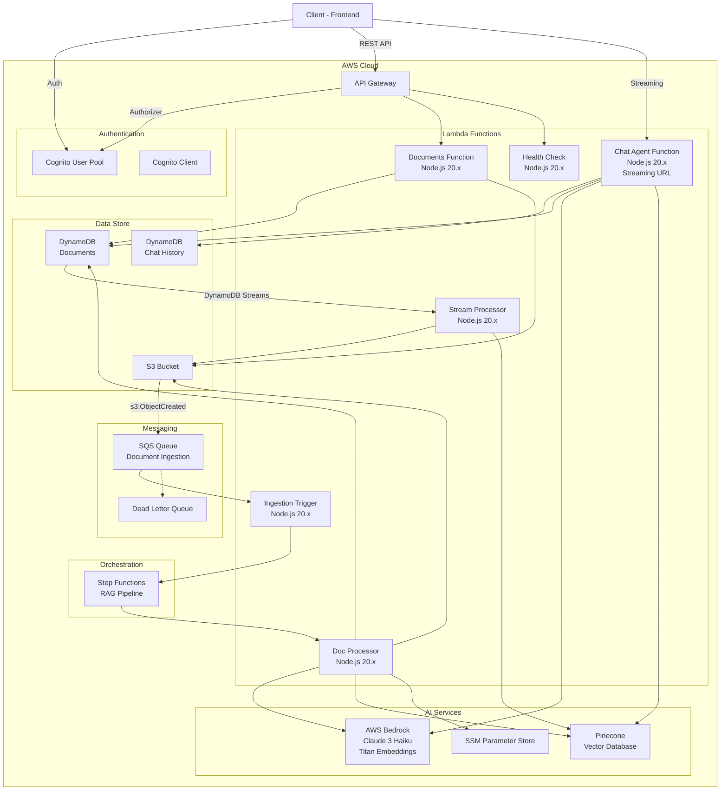

# Infrastructure - AWS SAM テンプレート

このディレクトリには、Myelin Base バックエンドの AWS Serverless インフラストラクチャが定義されています。

## 概要

AWS SAM (Serverless Application Model) を使用したサーバーレスアーキテクチャです。本番環境とローカル開発環境で異なるテンプレートを使用します。

| テンプレート          | 用途           | 認証            |
| --------------------- | -------------- | --------------- |
| `template.yaml`       | AWS (dev/prod) | Cognito         |
| `template-local.yaml` | LocalStack     | なし (バイパス) |

## アーキテクチャ図



## ディレクトリ構成

```
infrastructure/
├── src/
│   ├── functions/           # Lambda関数群
│   │   ├── chat/           # チャットAPI (ストリーミング対応)
│   │   ├── documents/      # ドキュメント管理API
│   │   ├── health/         # ヘルスチェック
│   │   ├── processor/      # DynamoDB Streams プロセッサ
│   │   └── trigger/        # S3イベントトリガー
│   └── shared/             # 共有コード (Lambda Layer)
├── scripts/                # ビルド/デプロイスクリプト
├── template.yaml           # SAMテンプレート (AWS環境)
├── template-local.yaml     # SAMテンプレート (ローカル環境)
├── samconfig.toml          # SAMデプロイ設定
└── tsconfig.json           # TypeScript設定
```

## Lambda 関数一覧

### 1. Documents Function (`documents/`)

ドキュメントの CRUD 操作と S3 署名付き URL の発行を担当。

- **エンドポイント**: `/documents/*`
- **認証**: Cognito JWT

### 2. Chat Agent Function (`chat/`)

RAG チャット機能を提供。Function URL でストリーミングレスポンスに対応。

- **エンドポイント**: Lambda Function URL (ストリーミング)
- **認証**: Cognito JWT (手動検証)

### 3. Ingestion Trigger Function (`trigger/`)

S3 へのファイルアップロードを SQS 経由で受信し、Step Functions を起動。

- **トリガー**: SQS (S3 `s3:ObjectCreated:*` イベント経由)
- **アクション**: RAG パイプライン (Step Functions) の実行開始

### 4. Doc Processor Function (`processor/`)

DynamoDB Streams のイベントを処理し、削除されたドキュメントのクリーンアップを実行。

- **トリガー**: DynamoDB Streams (Documents テーブル)
- **処理内容**:
  - ステータスが `DELETING` のドキュメントを検知
  - S3 からファイルを削除
  - Pinecone からベクトルを削除
  - DynamoDB からレコードを物理削除

### 5. Health Check Function (`health/`)

システムの稼働状況を確認するためのヘルスチェックエンドポイント。

## DynamoDB テーブル設計

### Documents Table

| 属性              | 型     | 説明                   |
| ----------------- | ------ | ---------------------- |
| `documentId` (PK) | String | ドキュメントID (UUID)  |
| `ownerId`         | String | 所有者ID (Cognito sub) |
| `fileName`        | String | ファイル名             |
| `fileSize`        | Number | ファイルサイズ (bytes) |
| `contentType`     | String | MIMEタイプ             |
| `status`          | String | ステータス             |
| `s3Key`           | String | S3オブジェクトキー     |
| `tags`            | List   | タグ配列               |
| `createdAt`       | String | 作成日時 (ISO8601)     |
| `updatedAt`       | String | 更新日時 (ISO8601)     |

**GSI: OwnerIndex**

- パーティションキー: `ownerId`
- ソートキー: `createdAt`

**ドキュメントステータス遷移**

```
PENDING_UPLOAD → PROCESSING → COMPLETED
                     ↓
                   FAILED

COMPLETED → DELETING → DELETED (物理削除)
```

### Chat History Table

| 属性              | 型     | 説明               |
| ----------------- | ------ | ------------------ |
| `sessionId` (PK)  | String | セッションID       |
| `historyId` (SK)  | String | 履歴ID             |
| `ownerId`         | String | 所有者ID           |
| `userQuery`       | String | ユーザーの質問     |
| `aiResponse`      | String | AIの回答           |
| `sourceDocuments` | List   | 参照ドキュメント   |
| `feedbackType`    | String | フィードバック種別 |
| `createdAt`       | String | 作成日時           |

## Parameters

### 共通パラメータ

| パラメータ                        | 必須 | デフォルト                               | 説明                             |
| --------------------------------- | :--: | ---------------------------------------- | -------------------------------- |
| `TABLE_NAME`                      |  ✅  | -                                        | Documents DynamoDB テーブル名    |
| `BUCKET_NAME`                     |  ✅  | -                                        | Documents S3 バケット名          |
| `BEDROCK_MODEL_ID`                |  -   | `anthropic.claude-3-haiku-20240307-v1:0` | Bedrock チャットモデルID         |
| `EMBEDDING_MODEL_ID`              |  -   | `amazon.titan-embed-text-v1`             | Bedrock エンベディングモデルID   |
| `PINECONE_API_KEY_PARAMETER_NAME` |  ✅  | `/myelinbase/dev/pinecone-api-key`       | SSM Parameter Store パラメータ名 |
| `PINECONE_INDEX_NAME`             |  ✅  | `myelinbase-documents`                   | Pinecone インデックス名          |
| `USE_BEDROCK`                     |  -   | `false`                                  | Bedrock使用フラグ                |

### 関数固有の環境変数

#### Documents Function

| 変数名                 | 必須 | デフォルト | 説明                                  |
| ---------------------- | :--: | ---------- | ------------------------------------- |
| `TABLE_NAME`           |  ✅  | -          | DynamoDB ドキュメントテーブル名       |
| `BUCKET_NAME`          |  ✅  | -          | S3 バケット名                         |
| `PRESIGNED_URL_EXPIRY` |  -   | `900`      | 署名付き URL の有効期限（秒）         |
| `DYNAMODB_ENDPOINT`    |  -   | -          | DynamoDB エンドポイント（ローカル用） |
| `S3_ENDPOINT`          |  -   | -          | S3 エンドポイント（ローカル用）       |

#### Chat Function

| 変数名                | 必須 | デフォルト | 説明                                |
| --------------------- | :--: | ---------- | ----------------------------------- |
| `TABLE_NAME`          |  ✅  | -          | Chat History DynamoDB テーブル名    |
| `DOCUMENT_TABLE_NAME` |  ✅  | -          | Documents DynamoDB テーブル名       |
| `USER_POOL_ID`        |  ✅  | -          | Cognito User Pool ID                |
| `CLIENT_ID`           |  ✅  | -          | Cognito Client ID                   |
| `USE_MOCK_BEDROCK`    |  -   | `false`    | モック Bedrock を使用（ローカル用） |

#### Trigger Function

| 変数名                    | 必須 | 説明                                    |
| ------------------------- | :--: | --------------------------------------- |
| `STATE_MACHINE_ARN`       |  ✅  | Step Functions ステートマシン ARN       |
| `PROCESSOR_FUNCTION_NAME` |  ✅  | Doc Processor Lambda 関数名             |
| `TABLE_NAME`              |  ✅  | Documents DynamoDB テーブル名           |
| `LOCALSTACK_ENDPOINT`     |  -   | LocalStack エンドポイント（ローカル用） |

#### Processor / Cleanup Function

| 変数名                            | 必須 | 説明                             |
| --------------------------------- | :--: | -------------------------------- |
| `TABLE_NAME`                      |  ✅  | Documents DynamoDB テーブル名    |
| `BUCKET_NAME`                     |  ✅  | Documents S3 バケット名          |
| `PINECONE_API_KEY_PARAMETER_NAME` |  ✅  | SSM Parameter Store パラメータ名 |
| `PINECONE_INDEX_NAME`             |  ✅  | Pinecone インデックス名          |
| `S3_ENDPOINT`                     |  -   | S3 エンドポイント（ローカル用）  |

### ローカル開発用環境変数

ローカル開発時は `local-dev/env.local.json` で設定を管理しています。詳細は [ローカル開発ガイド](./local-dev/LOCAL_DEVELOPMENT.md) を参照してください。

## API エンドポイント

### ベースURL

- **開発環境**: `https://<api-id>.execute-api.ap-northeast-1.amazonaws.com/dev`
- **本番環境**: `https://api.myelinbase.com`
- **ローカル環境**: `http://localhost:3000`

### 認証

すべてのエンドポイント（`/health` を除く）は Cognito JWT トークンが必要です。

```bash
# リクエストヘッダー
Authorization: Bearer <cognito-jwt-token>
```

### Documents API

ドキュメントの管理機能を提供します。

| メソッド | パス                           | 説明                 | 詳細ドキュメント                                           |
| -------- | ------------------------------ | -------------------- | ---------------------------------------------------------- |
| GET      | `/documents`                   | ドキュメント一覧取得 | [詳細](./infrastructure/src/functions/documents/README.md) |
| POST     | `/documents/upload`            | アップロードURL発行  | [詳細](./infrastructure/src/functions/documents/README.md) |
| GET      | `/documents/{id}`              | ドキュメント詳細取得 | [詳細](./infrastructure/src/functions/documents/README.md) |
| GET      | `/documents/{id}/download-url` | ダウンロードURL取得  | [詳細](./infrastructure/src/functions/documents/README.md) |
| DELETE   | `/documents/{id}`              | ドキュメント削除     | [詳細](./infrastructure/src/functions/documents/README.md) |
| PATCH    | `/documents/{id}/tags`         | タグ更新             | [詳細](./infrastructure/src/functions/documents/README.md) |

**レスポンス例**:

```json
// GET /documents
{
  "documents": [
    {
      "documentId": "550e8400-e29b-41d4-a716-446655440000",
      "fileName": "sample.pdf",
      "status": "COMPLETED",
      "fileSize": 102400,
      "contentType": "application/pdf",
      "tags": ["重要"],
      "createdAt": "2024-01-01T00:00:00.000Z",
      "updatedAt": "2024-01-01T00:05:00.000Z"
    }
  ]
}
```

### Chat API

RAG チャット機能を提供します。

| メソッド | パス                  | 説明                 |
| -------- | --------------------- | -------------------- |
| POST     | `/chat`               | チャットメッセージ送信（ストリーミング） |
| GET      | `/chat/sessions`      | セッション一覧取得   |
| GET      | `/chat/sessions/{id}` | セッション履歴取得   |

## データフロー

### 1. ドキュメントアップロードフロー

```text
Client → API Gateway → Documents Lambda
  ↓
1. 署名付きURL発行
  ↓
Client → S3 (直接アップロード)
  ↓
S3 Event → SQS → Trigger Lambda
  ↓
Step Functions (RAG Pipeline)
  ├─ テキスト抽出 (PDF → Text)
  ├─ チャンク分割 (Overlapping Window)
  ├─ エンベディング生成 (Bedrock Titan)
  └─ ベクトル保存 (Pinecone)
  ↓
DynamoDB ステータス更新 (COMPLETED)
```

### 2. チャットフロー

```text
Client → Chat Lambda (Function URL)
  ↓
1. クエリエンベディング生成 (Bedrock Titan)
  ↓
2. Pinecone で類似ベクトル検索
  ↓
3. コンテキスト構築
  ↓
4. Bedrock Claude でストリーミング生成
  ↓
5. メッセージ履歴を DynamoDB に保存
```

### 3. 削除フロー

```text
Client → API Gateway → Documents Lambda
  ↓
DynamoDB ステータス更新 (DELETING)
  ↓
DynamoDB Streams → Processor Lambda
  ├─ S3 ファイル削除
  ├─ Pinecone ベクトル削除
  └─ DynamoDB レコード物理削除
```

### 環境構成

| 環境            | ブランチ  | デプロイ先 | 認証                |
| --------------- | --------- | ---------- | ------------------- |
| **Local**       | -         | LocalStack | バイパス (user-001) |
| **Development** | `develop` | AWS (dev)  | Cognito             |
| **Production**  | `main`    | AWS (prod) | Cognito             |

## 技術スタック

| カテゴリ               | 技術                                              |
| ---------------------- | ------------------------------------------------- |
| **ランタイム**         | Node.js 20.x / TypeScript 5.9                     |
| **IaC**                | AWS SAM (Serverless Application Model)            |
| **コンピューティング** | AWS Lambda (arm64)                                |
| **API**                | API Gateway REST API                              |
| **認証**               | Amazon Cognito                                    |
| **データベース**       | DynamoDB                                          |
| **ストレージ**         | Amazon S3                                         |
| **メッセージング**     | Amazon SQS                                        |
| **AI/ML**              | Amazon Bedrock (Claude 3 Haiku, Titan Embeddings) |
| **ベクトルDB**         | Pinecone                                          |
| **シークレット管理**   | AWS Systems Manager Parameter Store               |
| **ワークフロー**       | AWS Step Functions                                |
| **ローカル開発**       | LocalStack, Docker Compose                        |

## クイックスタート

### 5分で始めるローカル開発

```bash
# 1. リポジトリのクローン
git clone <repository-url>
cd myelinbase-backend

# 2. 依存関係のインストール
npm install

# 3. Docker コンテナの起動
npm run local:start

# 4. ローカル環境へのデプロイ
npm run deploy:local

# 5. SAM Local API の起動（別ターミナル）
npm run api:start
```

### 次のステップ

1. [セットアップ](#セットアップ) - 詳細なセットアップ手順
2. [API エンドポイント](#api-エンドポイント) - API の使用方法
3. [ローカル開発ガイド](../local-dev/LOCAL_DEVELOPMENT.md) - ローカル環境での開発