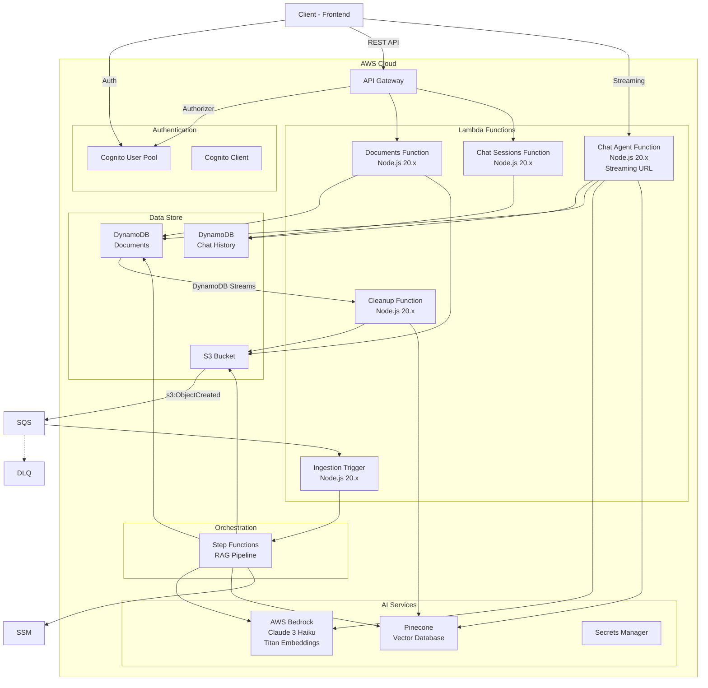

# Infrastructure - AWS SAM テンプレート

このディレクトリには、Myelin Base バックエンドの AWS Serverless インフラストラクチャが定義されています。

## 概要

AWS SAM (Serverless Application Model) を使用したサーバーレスアーキテクチャです。本番環境とローカル開発環境で異なるテンプレートを使用します。

| テンプレート          | 用途           | 認証            |
| --------------------- | -------------- | --------------- |
| `template.yaml`       | AWS (dev/prod) | Cognito         |
| `template-local.yaml` | LocalStack     | なし (バイパス) |

## アーキテクチャ図



## ディレクトリ構成

```
infrastructure/
├── src/
│   ├── functions/           # Lambda関数群
│   │   ├── chat/           # チャットAPI (ストリーミング対応)
│   │   ├── documents/      # ドキュメント管理API
│   │   ├── health/         # ヘルスチェック
│   │   ├── processor/      # DynamoDB Streams プロセッサ
│   │   └── trigger/        # S3イベントトリガー
│   └── shared/             # 共有コード (Lambda Layer)
├── scripts/                # ビルド/デプロイスクリプト
├── template.yaml           # SAMテンプレート (AWS環境)
├── template-local.yaml     # SAMテンプレート (ローカル環境)
├── samconfig.toml          # SAMデプロイ設定
└── tsconfig.json           # TypeScript設定
```

## Lambda 関数一覧

### 1. Documents Function (`documents/`)

ドキュメントの CRUD 操作と署名付きURL発行を担当。

| エンドポイント                     | 説明                 |
| ---------------------------------- | -------------------- |
| `GET /documents`                   | ドキュメント一覧取得 |
| `POST /documents/upload`           | アップロードURL発行  |
| `GET /documents/{id}`              | ドキュメント詳細取得 |
| `GET /documents/{id}/download-url` | ダウンロードURL取得  |
| `DELETE /documents/{id}`           | ドキュメント削除     |
| `PATCH /documents/{id}/tags`       | タグ更新             |

### 2. Chat Agent Function (`chat/`)

RAG チャット機能を提供。Lambda Function URL によるストリーミングレスポンス対応。

| エンドポイント                      | 説明                            |
| ----------------------------------- | ------------------------------- |
| `POST /chat/sessions`               | セッション作成                  |
| `GET /chat/sessions`                | セッション一覧取得              |
| `POST /chat/sessions/{id}/messages` | メッセージ送信 (ストリーミング) |
| `GET /chat/sessions/{id}/messages`  | メッセージ履歴取得              |
| `PATCH /chat/sessions/{id}`         | セッション名更新                |
| `DELETE /chat/sessions/{id}`        | セッション削除                  |
| `POST /chat/messages/{id}/feedback` | フィードバック送信              |

### 3. Ingestion Trigger Function (`trigger/`)

S3へのファイルアップロードをトリガーとして Step Functions を起動。

- **トリガー**: S3 `s3:ObjectCreated:*` (`uploads/` プレフィックス)
- **アクション**: RAG パイプライン (Step Functions) の実行開始

### 4. Doc Processor Function (`processor/`)

DynamoDB Streams のイベントを処理し、削除されたドキュメントのクリーンアップを実行。

- **トリガー**: DynamoDB Streams (Documents テーブル)
- **処理内容**:
  - ステータスが `DELETING` のドキュメントを検知
  - S3 からファイルを削除
  - Pinecone からベクトルを削除
  - DynamoDB からレコードを物理削除

### 5. Health Check Function (`health/`)

システムの稼働状況を確認するためのヘルスチェックエンドポイント。

## DynamoDB テーブル設計

### Documents Table

| 属性              | 型     | 説明                   |
| ----------------- | ------ | ---------------------- |
| `documentId` (PK) | String | ドキュメントID (UUID)  |
| `ownerId`         | String | 所有者ID (Cognito sub) |
| `fileName`        | String | ファイル名             |
| `fileSize`        | Number | ファイルサイズ (bytes) |
| `contentType`     | String | MIMEタイプ             |
| `status`          | String | ステータス             |
| `s3Key`           | String | S3オブジェクトキー     |
| `tags`            | List   | タグ配列               |
| `createdAt`       | String | 作成日時 (ISO8601)     |
| `updatedAt`       | String | 更新日時 (ISO8601)     |

**GSI: OwnerIndex**

- パーティションキー: `ownerId`
- ソートキー: `createdAt`

**ドキュメントステータス遷移**

```
PENDING_UPLOAD → PROCESSING → COMPLETED
                     ↓
                   FAILED

COMPLETED → DELETING → DELETED (物理削除)
```

### Chat History Table

| 属性              | 型     | 説明               |
| ----------------- | ------ | ------------------ |
| `sessionId` (PK)  | String | セッションID       |
| `historyId` (SK)  | String | 履歴ID             |
| `ownerId`         | String | 所有者ID           |
| `userQuery`       | String | ユーザーの質問     |
| `aiResponse`      | String | AIの回答           |
| `sourceDocuments` | List   | 参照ドキュメント   |
| `feedbackType`    | String | フィードバック種別 |
| `createdAt`       | String | 作成日時           |

## Parameters

### 共通パラメータ

| パラメータ                    | デフォルト                               | 説明                             |
| ----------------------------- | ---------------------------------------- | -------------------------------- |
| `ProjectName`                 | `myelinbase`                             | プロジェクト名                   |
| `Stage`                       | `dev`                                    | 環境 (dev/prod)                  |
| `FrontendUrl`                 | -                                        | フロントエンドURL (CORS)         |
| `UseBedrock`                  | `true`                                   | Bedrock使用フラグ                |
| `ChatModelId`                 | `anthropic.claude-3-haiku-20240307-v1:0` | チャットモデル                   |
| `EmbeddingModelId`            | `amazon.titan-embed-text-v1`             | エンベディングモデル             |
| `PineconeApiKeyParameterName` | `/myelinbase/dev/pinecone-api-key`       | SSM Parameter Store パラメータ名 |
| `PineconeIndexName`           | `myelinbase-documents`                   | Pinecone インデックス名          |

### 本番環境用パラメータ

| パラメータ       | 説明                                      |
| ---------------- | ----------------------------------------- |
| `DomainName`     | カスタムドメイン (例: api.myelinbase.com) |
| `CertificateArn` | ACM 証明書 ARN                            |
| `HostedZoneId`   | Route53 Hosted Zone ID                    |

## デプロイ

### ローカル環境 (LocalStack)

```bash
# プロジェクトルートから
npm run deploy:local
```

### AWS 開発環境

```bash
npm run deploy:dev
```

### AWS 本番環境

```bash
npm run deploy:prod
```

## samconfig.toml

デプロイ設定は `samconfig.toml` で管理しています。

```toml
[dev.deploy.parameters]
stack_name = "myelinbase-backend-dev"
parameter_overrides = [
  "Stage=dev",
  "FrontendUrl=*",
  ...
]

[prod.deploy.parameters]
stack_name = "myelinbase-backend-prod"
confirm_changeset = true
parameter_overrides = [
  "Stage=prod",
  "FrontendUrl=https://www.myelinbase.com",
  ...
]
```

## Outputs

| Output                    | 説明                               |
| ------------------------- | ---------------------------------- |
| `ApiEndpoint`             | API Gateway エンドポイントURL      |
| `ChatAgentEndpoint`       | Chat Function URL (ストリーミング) |
| `CognitoUserPoolId`       | Cognito User Pool ID               |
| `CognitoUserPoolClientId` | Cognito Client ID                  |
| `DocumentsBucketName`     | S3 バケット名                      |

## トラブルシューティング

### デプロイエラー

```bash
# スタックイベントを確認
aws cloudformation describe-stack-events \
  --stack-name myelinbase-backend-dev

# スタックを削除して再デプロイ
npm run delete:dev
npm run deploy:dev
```

### Lambda ログ確認

```bash
# SAM CLI でログ取得
cd infrastructure
sam logs --stack-name myelinbase-backend-dev --tail

# 特定の関数のログ
sam logs --name DocumentsFunction --stack-name myelinbase-backend-dev
```

### LocalStack ログ確認

```bash
# LocalStack コンテナログ
npm run local:logs:localstack

# Lambda 関数ログ (awslocal)
awslocal logs filter-log-events \
  --log-group-name /aws/lambda/myelinbase-local-documents \
  --limit 20
```
